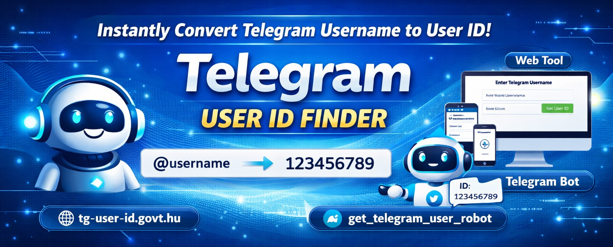

<p align="center">
  <a href="https://tg-user-id.govt.hu/" target="_blank">
    
  </a>
</p>

<p align="center">
  <b>Instantly convert Telegram Username into User ID — simple, fast, developer friendly.</b>
</p>

<h1 align="center">Telegram User ID Finder</h1>

<p align="center">
  <b>Username → User ID in Seconds</b><br>
  Developed by <a href="./">Amit Das</a>
</p>

---

## 🌐 Live Website
👉 https://tg-user-id.govt.hu/

---

## 🤖 Telegram Bot Available
You can also get Telegram User ID directly inside Telegram using our bot:

👉 https://t.me/get_telegram_user_robot

Just open the bot, send a username, and it will return the numeric Telegram ID instantly.

---

## Overview
Telegram User ID Finder is a lightweight web tool designed for developers, bot creators, and automation users who need a quick way to obtain a **Telegram numeric user_id from a public @username**.

The tool works instantly from the browser and helps eliminate manual searching or complex API scripting when building Telegram bots or integrations.

---

## ⚡ Core Features
- Convert `@username` → `user_id`
- Instant lookup
- Clean & mobile friendly interface
- Useful for bot development
- No login required
- Lightweight & fast response
- Telegram bot support

---

## 🔍 How To Use

### Website Method
1. Open the website  
   https://tg-user-id.govt.hu/

2. Enter a Telegram username  
   Example:
   ```
   @exampleuser
   ```

3. Click **Get User ID**

4. Copy the returned numeric Telegram ID

---

### Bot Method
1. Open the bot  
   https://t.me/get_telegram_user_robot

2. Send a username  
   Example:
   ```
   @exampleuser
   ```

3. Receive the user ID instantly

---

## 🧩 Use Cases

### Bot Development
Needed for:
- sendMessage
- restrictChatMember
- forwardMessage
- user permissions
- private automation

### API Integration
Map usernames to IDs inside databases or dashboards.

### Moderation & Logging
Track users reliably — username can change, ID never changes.

---

## ⚠️ Important Notes
- Works only for users with public usernames
- Private users without username cannot be resolved
- Telegram must allow the user to be discoverable

---

## 🔒 Privacy
This tool:
- Does NOT store usernames
- Does NOT track users
- Does NOT save requests
- Only performs real-time lookup

No analytics or persistent logging is used.

---

## 🛠 API Access
If you want to integrate the lookup into your own project or bot system, contact:

Telegram: @AmitDas4321

---

## 🧰 Who This Is For
- Telegram Bot Developers
- Automation Engineers
- Community Managers
- CRM Builders
- Database Synchronization Tools

---

## 📬 Support
For help, feature request, or integration assistance:

Telegram: @AmitDas4321

---

## 📜 License
© 2026 Amit Das — All rights reserved.  
This project is provided as a utility tool for Telegram development workflows.

---

<p align="center">
  <b>Made with ❤️ by <a href="https://amitdas.site">Amit Das</a></b><br>
  ☕ Support development: <a href="https://paypal.me/AmitDas4321">PayPal.me/AmitDas4321</a>
</p>
